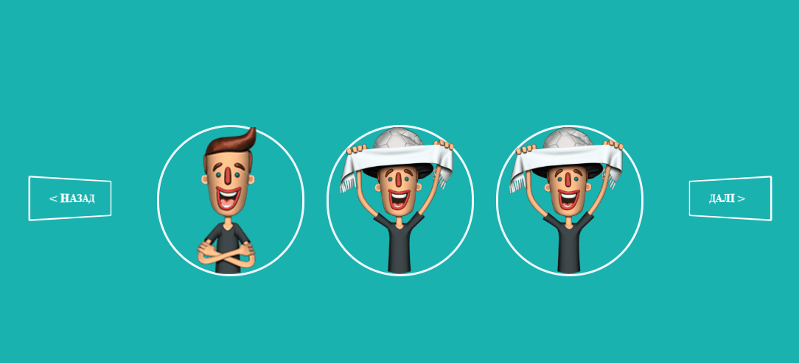

# Character slider

## About
Simple application for sliding characters by click on next or previous buttons.

## Demo
Avaliable on [this location](https://lukashenkoevgeniy.github.io/character_slider/)

## Frameworks and libs

+ Package manager - [npm](https://www.npmjs.com)
+ Builder - [Webpack](https://webpack.js.org/)
+ Transpiler - [Babel](https://babeljs.io/)
+ User Interface - [React](https://reactjs.org/)
+ Animations - [Pose](https://popmotion.io/pose/)

## Run and build

### Pull project and **install dependencies**:

`npm install`

### Run project:

`webpack-dev-server --mode development --hot`

It will be available by the link http://localhost:8080/

### For **build project** run following command:

`webpack --mode production`
